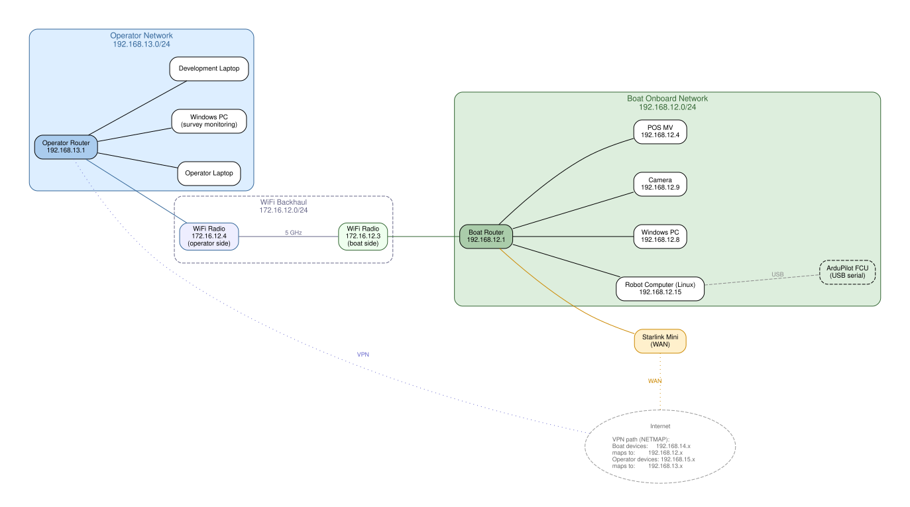

# unh_echoboats_project11

ROS 2 configuration and launch files for UNH CCOM's EchoBoat 160 (IzzyBoat).

## Packages

- **izzyboat_project11** — URDF, launch files, and configuration for IzzyBoat.
  Includes sensor drivers (OAK-D camera, DeltaT sonar), navigation stack
  integration, and UDP bridge configuration for operator communication.

## Network

IzzyBoat communicates with the operator station over a dedicated WiFi backhaul
link and a VPN fallback path. See [docs/izzyboat_network.md](docs/izzyboat_network.md)
for full network documentation.

## Documentation

- [Network setup](docs/izzyboat_network.md) — subnets, devices, VPN configuration, router details
- [Hardware measurements](izzyboat_project11/measurements.md) — physical dimensions and dynamics
- [Camera calibration](izzyboat_project11/camera_calibration.md) — camera calibration notes
