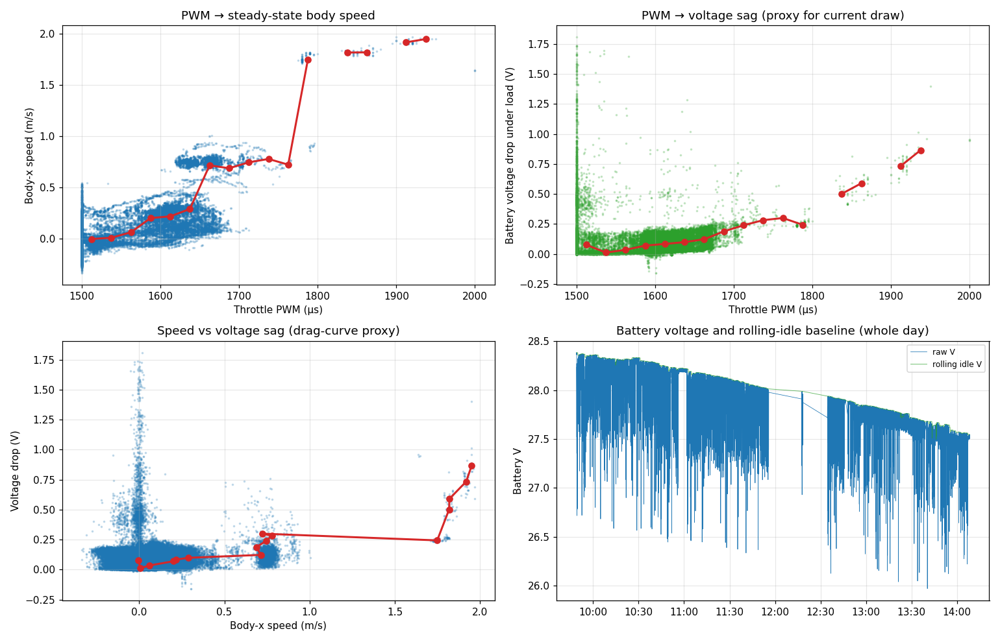

# BizzyBoat dynamics — preliminary findings (2026-04-24)

Captured from analysis of the 2026-04-24 in-water bags (`~/data/logs/bizzyboat/`,
five sessions covering 09:48–14:08 between crane deploy and recover). This is a
*preliminary* characterization, not a calibration; gaps in the data are flagged
below and a follow-up focused field experiment is tracked in
[`#88`](https://github.com/rolker/unh_echoboats_project11/issues/88).

## TL;DR

- **PWM → speed mapping** (steady-state) is broadly visible; ~PWM 1660 = 1.4 kt,
  ~PWM 1790 = 3.4 kt, ~PWM 1940 = 3.8 kt observed maximum.
- **There is a non-monotonic step around PWM 1640–1660** — likely the
  Torqeedo throttle threshold or a planing transition. Not characterized in
  detail; only ~2400 samples land in that bin.
- **Power-vs-speed is not measurable from this data**: the Cube reads battery
  voltage but the Torqeedo packs do not expose current to the FCU
  (`BATT_MONITOR=4` reports zero current). See `project_bizzyboat_autonomy_stack.md`
  in agent memory.
- **Voltage drop under load** is used as a power proxy — useful for relative
  comparisons but noisy because the day-long battery discharge contaminates
  the per-bin baseline.
- **Path-follower tracks well when actively engaged**: Plan 14 in session 5
  (47.9 m line, 13:58:51) achieved sub-meter XTE with max 0.61 m. No PID
  tuning indicated. Tracked separately; this doc focuses on dynamics.

## Methodology

1. Five bag sessions concatenated and clipped to in-water bounds 09:48:58 →
   14:08:21 (crane edges identified by GPS altitude transitions through ~5 m,
   filtered to RTK_FIXED fixes only).
2. GPS velocity (ENU x/y from `/bizzy/mavros/global_position/raw/gps_vel`)
   projected to body frame using IMU-derived yaw at each sample.
3. Steady-state filter: PWM stable within ±25 μs and body-x speed stable
   within ±0.05 m/s over a 3 s window. Forward-only (PWM ≥ 1500). 58,516
   steady samples retained out of 131,127 raw rc/out samples (44.6 %).
4. Voltage-drop baseline: 90 s rolling-window max of voltage during near-idle
   PWM (1480–1520 μs). Rough; expect noise floor ≈ 50 mV.
5. Per-PWM bins of 25 μs width; reported median speed and median voltage drop
   per bin where ≥ 5 samples are present.

## Steady-state PWM → speed → V-drop

| PWM (μs) | n   | speed (m/s) | knots | V drop (V) | V_drop / kt |
|----------|----:|------------:|------:|-----------:|-----------:|
| 1512     | 41821 | 0.00 | 0.00 | 0.077 | — |
| 1538     |  1419 | 0.01 | 0.02 | 0.012 | — |
| 1562     |  1147 | 0.06 | 0.12 | 0.035 | 0.30 |
| 1588     |  3405 | 0.20 | 0.39 | 0.070 | 0.18 |
| 1612     |  4388 | 0.22 | 0.42 | 0.084 | 0.20 |
| 1638     |  3173 | 0.29 | 0.56 | 0.099 | 0.18 |
| **1662** |  2438 | **0.72** | **1.39** | **0.123** | **0.09** |
| 1688     |   334 | 0.69 | 1.33 | 0.188 | 0.14 |
| 1712     |   182 | 0.75 | 1.45 | 0.240 | 0.17 |
| 1738     |    29 | 0.78 | 1.51 | 0.282 | 0.19 |
| 1762     |    17 | 0.72 | 1.40 | 0.300 | 0.21 |
| **1788** |    78 | **1.75** | **3.39** | **0.244** | **0.07** |
| 1838     |    17 | 1.82 | 3.53 | 0.502 | 0.14 |
| 1862     |    23 | 1.82 | 3.53 | 0.590 | 0.17 |
| 1912     |    31 | 1.92 | 3.72 | 0.734 | 0.20 |
| 1938     |     6 | 1.95 | 3.78 | 0.864 | 0.23 |

(Bold rows are local minima of the V_drop / kt efficiency proxy — possible
sweet-spot operating points.)

The four panels show:

- Top-left: PWM → body-x speed scatter + median per bin.
- Top-right: PWM → V-drop scatter + median per bin.
- Bottom-left: speed vs V-drop ("drag-curve proxy").
- Bottom-right: raw battery voltage and rolling-idle baseline over the day.

## Notable features

### Throttle step around PWM 1638 → 1662

Speed jumps from 0.6 kt (PWM 1638) to 1.4 kt (PWM 1662) — only +24 μs but
2.5× speed. Could be:

- Torqeedo electronic-throttle threshold (motor stays in low-RPM idle until a
  command magnitude crosses a deadband).
- Hull-pop-up onto a planing-ish regime.
- Artifact of the steady-state filter at moderate-but-changing speeds.

The bin sample counts narrow this: 3173 samples at 1638 vs 2438 at 1662, so
both regions are well-populated but the boat just doesn't sit at intermediate
speeds. This is one of the things [`#88`](https://github.com/rolker/unh_echoboats_project11/issues/88)
will resolve with steady PWM holds at 1640, 1645, 1650, 1655, 1660 etc.

### Two efficiency sweet spots

**PWM 1662 → 1.4 kt** (V_drop / kt = 0.09): post-throttle-step, pre-saturation.
Comfortable for confined surveys and station-keeping.

**PWM 1788 → 3.4 kt** (V_drop / kt = 0.07): surprisingly efficient at high
speed. Probably sits in a planing-or-near-planing regime where induced drag
has dropped relative to wave drag — but with only 78 samples in the bin this
is preliminary. Worth confirming.

Above ~3.7 kt, V-drop more than doubles per knot of additional speed. Avoid
for sustained operation.

### Operationally suggested cruise defaults

Based on what's visible in this data set (subject to revision after `#88`):

| Use case        | Suggested PWM | Speed | Notes |
|-----------------|---------------|-------|-------|
| Confined survey | 1700 ± 25     | 1.5 kt | predictable; easily trimmed |
| Standard survey | 1760 ± 25     | 2.0 kt | inferred between observed bins; **uncalibrated** |
| Fast survey / transit | 1790 ± 10 | 3.4 kt | post-step efficiency point |
| Max practical   | < 1900        | < 3.7 kt | above this, V-drop runs away |

## Caveats

1. **V-drop ≠ power.** True power = V × I; only V is read. The V-drop proxy
   captures the qualitative sense of "harder work" but doesn't quantify it.
   [`#88`](https://github.com/rolker/unh_echoboats_project11/issues/88) covers
   adding a current sensor as a stretch.
2. **Day-long battery discharge** masks short-term loaded-V-drop. The 90 s
   rolling-idle baseline approximates an "instantaneous open-circuit V" but
   it's noisy near the start/end of the day.
3. **Low-sample bins (n < 50)** in the high-PWM region (above 1750) make
   point estimates unreliable. Visual confirmation of the curves is honest;
   bin-level numbers are not.
4. **No reciprocal-pair averaging applied** to today's data. Today the boat
   ran a mix of plans / MANUAL stretches at various headings, so current
   contributes to body-x in a heading-dependent way that I don't fully
   cancel here. The L43↔L44 reciprocal pair from session 5's late-afternoon
   line set (analyzed in chat, not committed) gave a clean -0.046 m/s body-x
   bias at PWM ~1700 → suggests ~5 % under-thrust at that speed, but no
   broader sweep.

## Provenance

- Source bags: `~/data/logs/bizzyboat/2026-04-24T*` (5 sessions; ~5h total)
- Crane bounds: 09:48:58 deploy / 14:08:21 recover (RTK_FIXED altitude
  threshold method)
- Plot pipeline: ad-hoc Python using `rosbag2_py`, plot saved alongside this
  doc as `bizzyboat_dynamics_2026-04-24.png`. Not yet a reusable tool — see
  the bag-loader DataFrame idea in [`#88`](https://github.com/rolker/unh_echoboats_project11/issues/88)
  for productionizing this analysis.

## See also

- [`#88`](https://github.com/rolker/unh_echoboats_project11/issues/88) — focused
  field-experiment plan to fill in this curve
- `project_bizzyboat_autonomy_stack.md` (agent memory) — current sensor not
  wired; rationale for V-drop-as-proxy
- `bizzyboat_thruster_test_2026-03-31.md` — earlier static-thrust test from
  before in-water sessions
