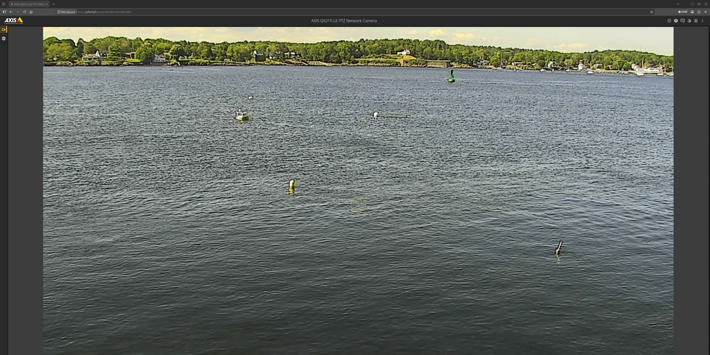

# BizzyBoat Operator Manual

A guide for **operators** running BizzyBoat. It covers the *project11 autonomy
layer* on top of the boat — how to bring the boat up, drive it, run a survey, and
shut it down.

> **Scope.** This manual is *not* a hardware manual. For the hull, thrusters,
> charging, and physical handling of the boat, see the **EchoBoat 240 vendor
> manual**. Launch and recovery are site-specific and are covered in the field
> briefing, not here. For *how the autonomy stack works internally* (the control
> chain, command state machine, collision monitor), see the **marine-autonomy
> framework guide** (`unh_marine_autonomy`, `docs/how_the_stack_works.md`). When
> something behaves unexpectedly, the framework guide — not a symptom→cure list
> here — is where to build understanding.

---

## 1. Overview & safety

**BizzyBoat is an EchoBoat 240** — a small, **uncrewed** autonomous survey boat. It
carries no one. Everything in this manual happens from the **operator station** on
shore (or on a support vessel), with the boat on the water.

Two computers matter to you:

| Host | Role |
|------|------|
| **gabby** | The boat's Linux/ROS computer. Runs the autonomy stack. |
| **mercat** | The boat's Windows computer (QINSy + M3 sonar / survey acquisition). Separate from autonomy. |

The operator station (a shore laptop/PC, e.g. **salmon**) runs CAMP — the map and
mission-planning interface — and the operator-side ROS nodes.

> `bizzy` is a **ROS namespace**, not a host. Topics like `/bizzy/marine/...`
> belong to the boat; there is no machine called "bizzy."

### Safety: RC override is always available

A human pilot can take manual control **at any time** with the RC controller. This
is the primary safety mechanism. Pressing **Standby** (from CAMP or the controller)
hands the boat to **MANUAL** control immediately — see [§5](#5-driving--autonomy).
When in doubt, take manual control.

---

## 2. Readiness checks (before you put the boat in autonomy)

Confirm each of these before running a survey. Most are visible on the operator
station's annunciator panel and in CAMP.

### Power / battery

- BizzyBoat's batteries are **charged in place — there is no battery swap.** Plan
  around **recharge-to-full time**, not a hot-swap; this is the constraint that
  paces how often you can run back-to-back.
- Watch **battery voltage** (the annunciator's `mavros: Battery` indicator):
  - **Warn below 23.0 V**, **error below 21.5 V** (a healthy pack reads ~28 V).
  - **There is no current or power reading on this boat.** The current field is a
    placeholder (~0.01 A) — **voltage is the only real battery number.** Never
    report amps or watts.

### Endurance & range (rough planning guide)

These are **modeled estimates**, not measured — the boat has no current meter, so
endurance comes from a voltage-based power model. Treat them as **planning heuristics
(±30 % or more)** and always keep a reserve for the return leg. Figures are to a fully
empty pack; speeds are through-water (≈ over-ground in calm water like a lake).

| Speed | Endurance | Range |
|---|---|---|
| Station-keep (0 kn) | ~44 h | — |
| Slow survey ~1.5 kn (0.77 m/s) | ~11–23 h | ~31–65 km (17–35 nm) |
| **Cruise ~3.0 kn (1.52 m/s)** | **~6–10 h** | **~35–53 km (19–29 nm)** |
| Full ~3.7 kn (1.9 m/s) | ~4.5 h | ~29–31 km (16–17 nm) |

- **Cruise covers the most water per charge** — going faster than ~3 kn burns a lot
  more battery for little extra range.
- **Plan to the low (conservative) end** and keep a return-leg reserve; don't run to empty.
- Recharge-to-full time (not range) is what paces back-to-back runs.

### Positioning / RTK

- The boat needs a good GNSS fix before survey-quality autonomy. The `gps_rtk`
  diagnostic reports fix type: **type ≥ 6 is OK** (RTK), **type 3 is a warning**
  (no RTK), below that is not survey-ready.
- RTK corrections arrive over **NTRIP**. If RTK won't lock, check that the NTRIP
  client is connected (the `NTRIP` annunciator goes to error if corrections stop
  for ~15 s).

### Time synchronization

Survey data is only as good as its timestamps: the M3's pings, the boat's nav,
and the logged bags all have to agree on the clock. The boat carries a
**GPS-disciplined NTP appliance** (a Time Machines TM2000B) as the canonical
time source — `time.bizzy.p11.lan` (`192.168.20.123`), stratum-1, GPS-anchored.
gabby, mercat, the boat router, and the bridges all sync to it.

Confirm time sync is healthy before a survey (operator-driven — these are
command-line checks, not annunciator items):

- **mercat** (Windows / QINSy): `ntpq.exe -pn` — expect `*192.168.20.123`
  (`time.bizzy.p11.lan`, refid `.GPS.`) selected, offset well under ~10 ms.
- **gabby** (Linux): `chronyc tracking` — converged against the same source.

If mercat's clock is off, QINSy logging timestamps drift. Background on the
boat-router NTP stack is in
[`bizzyboat_ntp_investigation_2026-04-09.md`](bizzyboat_ntp_investigation_2026-04-09.md).

### Sound velocity (survey)

The boat carries an **AML sound-velocity sensor (SVS)** — a through-hull probe
mounted alongside the M3 sonar (AML, SN 11357, 6000 m depth rating). It measures
the **speed of sound in the water at the sonar head**, which the M3 multibeam
needs to form and ray-bend its beams; a wrong or missing value degrades survey
data.

- The reading is published into ROS at `/bizzy/sensors/sound_speed/sound_speed`
  and delivered to the M3 on mercat. *(How that delivery is wired — the AML → M3
  path — is in the [2026 Field Season Guide](bizzyboat_2026_field_season_guide.md).)*
- **Confirm before a survey:** the sound-speed value is present and sensible
  (~1450–1520 m/s once the probe is submerged). It reads near zero / nothing
  until the probe is in the water and producing.
- **Known issue:** the AML has been seen emitting all-NUL bytes on its serial
  line ([#163](https://github.com/rolker/unh_echoboats_project11/issues/163)). If
  the M3 shows no sound speed, check this first.
- Full device specs and mounting offsets:
  [reference geometry](../bizzyboat_project11/docs/bizzyboat_reference_geometry.md)
  and the
  [hydro payload install log](../bizzyboat_project11/docs/hydro_payload_install_log.md).

### Comms link

- The operator station talks to the boat over a **WiFi backhaul** (primary) with a
  **Starlink/VPN** fallback. Confirm the link indicators are green before relying
  on remote control. See [§6](#6-comms--range).

---

## 3. Starting the stack

### Boat side (gabby) — usually automatic

The boat computer is configured to **start the autonomy stack automatically on
power-up** (via the `field` user's `@reboot` cron job running
`scripts/start_tmux_project11.bash`). Power the boat on and the stack comes up in
this order:

1. **Zenoh router** (`rmw_zenohd`) — the ROS middleware router. Everything else
   waits for it.
2. **Core** (`core_launch.py`) — MAVROS (flight-controller link on `/dev/fcu`),
   the helm, transforms, UDP bridge to the operator, NTRIP, etc.
3. **Perception** (`perception_launch.py`) — cameras, sonar logging, the
   forward-facing segmentation used by the collision monitor.
4. **Navigation** (`nav_launch.py`) — the Nav2 stack configured for model **240**.

> For the *physical* power-on (battery switches, etc.) follow the field briefing
> and [`bizzyboat_project11/docs/bizzyboat_power.md`](../bizzyboat_project11/docs/bizzyboat_power.md);
> this section covers only the software bring-up.

### Operator side (salmon) — you start this

On the operator station, start the operator launcher
(`scripts/start_tmux_operator_project11.bash`). It brings up, again zenoh-first:
the operator core nodes, the **operator UI** (CAMP with the `bizzyboat`
perspective), the diagnostics view (rqt), the Axis PTZ camera, and the
screenshooter.

### Confirming the boat is up

The boat **advertises itself** to the operator station. When the link is healthy
and the boat's stack is running, **BizzyBoat appears as its own tab in CAMP** (CAMP
auto-creates a tab per platform it hears on `/marine/platforms`). If the tab never
appears, the boat side isn't reaching the operator — check the comms link and that
gabby's stack actually started. See the **CAMP user manual** for the operator-side
view of this.

---

## 4. The operator station displays

Once the stack is up, the operator station shows the boat across several windows on
its monitors. **These are separate from CAMP.** CAMP is the map / mission-planning
view (see the CAMP user manual); the **camera feeds** and the **annunciators** are
their own windows — a common point of confusion is to look for them inside CAMP,
where they do not live.

### Cameras

- **Situational-awareness camera (AXIS PTZ).** A steerable camera for watching the
  boat's surroundings (and the boat itself when in view). Useful for keeping eyes on
  traffic and the boat during a run.

  

- **Perception cameras (OAK) + segmentation.** The four OAK cameras — **port,
  forward, starboard, aft** — and their **segmentation** view, shown in an rqt
  window (titled `bizzyboat - rqt`), *not* CAMP. In the segmentation tiles, **blue =
  sky, green = water, red = the water/obstacle boundary**. The forward segmentation
  feeds the collision monitor (the boat's reflex safety stop).

  

### Annunciators (diagnostics)

The **annunciators** are a separate diagnostics display showing system health —
comms links, GPS/RTK, battery, nav stack, mission manager, etc. **Green = OK, yellow
= warning, red = error.** This is where the readiness checks in §2 show up at a
glance, and where you watch for problems during a run.

- Annunciator naming distinguishes the diagnostic **source** — "boat" vs "operator"
  — **not** where the display lives. **Both run at the operator station** (the boat
  is uncrewed).
- The `bizzyboat-diagnostics` runtime monitor (Stale / Errors / Warnings / OK
  counts) and per-link indicators (e.g. "Op Starlink", "Ping Gabby (WiFi)") are part
  of this display.

---

## 5. Driving & autonomy

You command the boat three ways: the **RC controller** (manual), the **CAMP map**
(overrides like Hover and Goto), and **survey missions** (planned lines sent from
CAMP). The detailed CAMP button-by-button flow is in the **CAMP user manual**; this
section explains what the commands *mean*.

### Manual (RC) and Standby

- The RC controller drives the boat directly when the boat is in **manual**.
- **Standby** puts the boat in **MANUAL** and hands control to the RC pilot
  **immediately**. This is the instant-handoff safety path. Because the boat stops
  holding position, **some drift after Standby is expected and normal** — it is not
  a fault.

### Autonomy overrides — Hover and Goto

- **Hover**: hold position at a point. (Re-commanding hover currently reuses the
  original hover spot in some cases — a known boat-side behavior; clear and
  re-send if you need a new spot.)
- **Goto**: drive to a point, then hold.
- These put the boat in **autonomous** mode.

### Running a survey line

- Survey lines are planned and sent from **CAMP** (see the CAMP user manual,
  *Planning a survey* and *Sending & controlling missions*). The boat follows the
  active line under Nav2.
- **Re-sending a different line mid-line may not take effect immediately** — the
  behavior tree latches the path it is following. If a line switch doesn't take,
  **clear the mission and re-send**.

### The heartbeat is your acknowledgement

- The boat publishes a **heartbeat** that reflects the command currently applied.
  **The heartbeat updating *is* the "command received and applied" acknowledgement** —
  there is no separate popup.
- If the heartbeat lags after you send a command, that is almost always **link
  saturation** (a busy or degraded comms link), **not** a UI bug. Give it a moment
  or check the link.

---

## 6. Comms & range

- **Primary link:** WiFi backhaul (`gabby.bizzy.p11.lan`). **Fallback:**
  Starlink/VPN. The UDP bridge moves ROS traffic across whichever path is up.
- **Operating Over The Horizon (OTH) — i.e. beyond direct line-of-sight comms — is
  normal** for this boat and routine for a shore-based operator during a lake
  survey. The link **degrades gracefully** as range/obstruction increases.
- **A brief link drop is not an error.** The boat keeps doing what it was last
  commanded; the operator-side view catches up when the link recovers. Do not treat
  a momentary loss of telemetry as a failure — watch for it to recover, and keep the
  RC controller within reach if the boat is close.

---

## 7. Shutdown & post-run

1. Bring the boat back under **manual (RC)** control for recovery — press
   **Standby**.
2. Recover the boat per the field briefing (site-specific).
3. Power down the boat per the EchoBoat 240 vendor manual /
   [`bizzyboat_power.md`](../bizzyboat_project11/docs/bizzyboat_power.md). The
   autonomy stack stops when gabby powers off.
4. **Put the boat on charge** — remember there is no swap; the next run waits on a
   full charge.
5. Survey data on **mercat** (QINSy) is handled by the survey workflow, separately
   from the autonomy bags on gabby.

---

## See also

- **CAMP user manual** (`camp`, `docs/camp_user_manual.md`) — the operator-station
  interface: planning lines, sending missions, reading the display.
- **Marine-autonomy framework guide** (`unh_marine_autonomy`,
  `docs/how_the_stack_works.md`) — how the autonomy stack works; the place to build
  understanding when behavior is surprising.
- [2026 Field Season Guide](bizzyboat_2026_field_season_guide.md) — the borrowed
  survey payload (M3 multibeam, SBG INS) and how it's wired in this season,
  including the NTRIP → SBG and AML → M3 integration paths.
- [BizzyBoat hardware](../bizzyboat_project11/docs/bizzyboat_hardware.md),
  [power](../bizzyboat_project11/docs/bizzyboat_power.md),
  [reference geometry](../bizzyboat_project11/docs/bizzyboat_reference_geometry.md).
- [Network setup](bizzyboat_network.md) — subnets, devices, VPN, router details.
